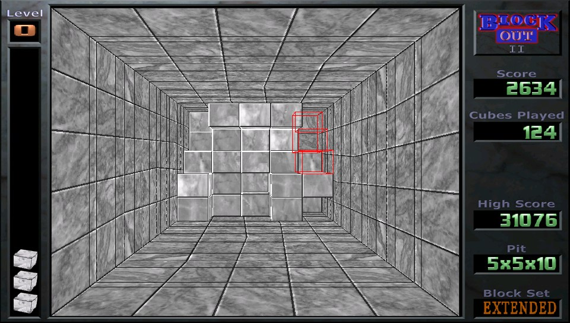

#BlockOut II for Playstation Vita

This is a Sony Playstation Vita port of BlockOut II game by Jean-Luc PONS.

http://www.blockout.net/blockout2

BlockOut II is reimplementation of original 1989 puzzle video game, developed in Poland by
Aleksander Ustaszewski and Mirosław Zabłocki and published by California Dreams for multiple
platforms. Original BlockOut was the first video game which transfered tetris from 2D into 3D.

https://en.wikipedia.org/wiki/Blockout

This port is based on BlockOut II release 2.5

##Game screenshots

Screenshots of different graphical game skins

<figure>
  <figcaption>Graphical skin: Nostalgia</figcaption>
  
</figure>
<figure>
  <figcaption>Graphical skin: Arcade</figcaption>
  
</figure>
<figure>
  <figcaption>Graphical skin: Marble</figcaption>
  
</figure>

##Binary installation

https://github.com/bomblik/BlockOut_II_PSVITA/releases/tag/BlockOut_II_PSVITA_2.5

Install vpk file according to instructions found on

https://henkaku.xyz/usage

##Source installation

###Compilation

In order to compile BlockOut_II_PSVITA, please install vitasdk
and set development environment.

To compile project invoke

    cd ImageLib/src
    build.sh

    cd ../../BlockOut
    make -f Makefile.psvita

###Installation

Follow instructions from Binary installation section.

##Key mappings

    CROSS                    - confirm / drop block
    RIGHT TRIGGER            - cancel / exit game

    D-PAD                    - move block / select character (hall of fame)

    SQUARE                   - rotate block around X axis counterclockwise
    SQUARE   + LEFT TRIGGER  - rotate block around X axis clockwise
    TRIANGLE                 - rotate block around Y axis counterclockwise
    TRIANGLE + LEFT TRIGGER  - rotate block around Y axis clockwise
    CIRCLE                   - rotate block around Z axis counterclockwise
    CIRCLE   + LEFT TRIGGER  - rotate block around Z axis clockwise

    START                    - pause / resume game

##Online score database

The game has a strong user community and an online world ranking of user scores.

http://www.blockout.net/blockout2/worldranking/index.php

http://www.blockout.net/blockout2/scoredate.php

Currently you can play against / compare your score to an online score database, but you cannot upload your scores.

Please look at TODO section, regarding score uploading.

##Credits

Jean-Luc PONS for an awesome game.
 
Fabrice Bellard for TinyGL, an OpenGL software implementation.
 
Team Molecule for HENkaku homebrew enabler.
 
All vitasdk contributors.
 
xerpi, Cpasjuste for SDL library port.
 
Cpasjuste for PSP2SHELL, ports of SDL auxiliary libraries and TinyGL.

##TODO

The game has an option to upload user scores to the game server, but that option is only included in binary releases for pc.

Reverse engineering of 'reply file' content and communication protocol is needed in order to upload user scores from PS VITA port of the game.

##Disclaimer

There are some minor graphical issues due to TinyGL limitations.